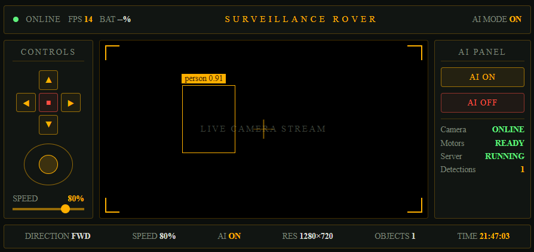

# Surveillance Rover

An AI-powered surveillance rover built using **Raspberry Pi 5**, **Flask**, **OpenCV**, and **YOLOv8**. It provides live HD video streaming, browser-based remote driving, real-time object detection, and a tactical HUD interface that works on phones, tablets, and laptops.

---

## Preview



---

## Features

- Live MJPEG video streaming from the Raspberry Pi Camera Module 3
- Real-time object detection using YOLOv8 Nano with ONNX Runtime
- Tactical HUD dashboard with live FPS, object count, AI status, and movement direction
- Browser-based rover control (Forward, Backward, Left, Right, Stop)
- Adjustable motor speed using PWM
- Toggle AI detection ON/OFF without restarting the application
- Live telemetry updated every second
- Mobile-friendly gaming-inspired interface

---

## Architecture

```text
Phone / Tablet / Laptop
          │
        HTTP
          │
          ▼
┌───────────────────────────┐
│        Flask Server       │
│   app.py (Routes & API)   │
└───────┬───────────┬────────┘
        │           │
        ▼           ▼
 ┌────────────┐  ┌────────────┐
 │ camera.py  │  │ motor.py   │
 │ Picamera2  │  │ gpiozero   │
 └─────┬──────┘  └─────┬──────┘
       │               │
       ▼               ▼
┌─────────────┐     L298N Driver
│ YOLOv8 AI   │ ───► DC Motors
│ ONNX Runtime│
└─────────────┘
```

Each captured frame follows this pipeline:

**Camera → Optional YOLO Detection → Bounding Boxes → JPEG Encoding → MJPEG Stream → Browser**

Live FPS, AI status, and detection statistics are shared through the telemetry module and displayed on the HUD.

---

## Hardware

| Component | Specification |
|-----------|---------------|
| Computer | Raspberry Pi 5 |
| Camera | Raspberry Pi Camera Module 3 |
| Motor Driver | L298N |
| Motors | 2 × DC Gear Motors |
| Chassis | Tracked Rover Chassis |
| Power | 3S LiPo Battery + 5V 7A UBEC |

---

## Software Stack

### Backend
- Python 3.13
- Flask
- Picamera2
- OpenCV
- ONNX Runtime
- gpiozero

### AI
- YOLOv8 Nano
- ONNX Model
- COCO Dataset (80 Classes)

### Frontend
- HTML5
- CSS3
- JavaScript
- Responsive Tactical HUD

---

## Project Structure

```text
rover/
├── ai/
│   ├── detector.py
│   └── labels.py
│
├── models/
│   └── yolov8n.onnx
│
├── static/
│   ├── style.css
│   └── script.js
│
├── templates/
│   └── index.html
│
├── app.py
├── camera.py
├── config.py
├── motor.py
├── telemetry.py
├── README.md
└── hud.png
```

---

## Installation

Clone the repository:

```bash
git clone https://github.com/bichitrahazarika/surveillance-rover.git
cd surveillance-rover
```

Create a virtual environment:

```bash
python3 -m venv rover-env --system-site-packages
```

Activate it:

```bash
source rover-env/bin/activate
```

Install dependencies:

```bash
pip install -r requirements.txt
```

Run the application:

```bash
python app.py
```

Open your browser and visit:

```text
http://<raspberry-pi-ip>:5000
```

Landscape orientation is recommended for the best experience on mobile devices.

---

## API Endpoints

| Endpoint | Description |
|----------|-------------|
| `/` | Main HUD Dashboard |
| `/video_feed` | Live MJPEG Video Stream |
| `/forward` | Move Forward |
| `/backward` | Move Backward |
| `/left` | Turn Left |
| `/right` | Turn Right |
| `/stop` | Stop Rover |
| `/speed?value=0.8` | Set Motor Speed |
| `/ai/on` | Enable AI Detection |
| `/ai/off` | Disable AI Detection |
| `/ai/status` | Get AI Status |
| `/telemetry` | Live Rover Statistics |

---

## Future Improvements

- 🎮 Gamepad Support
- 🔋 Battery Monitoring
- 📍 GPS Navigation
- 🎯 Object Tracking
- 👤 Person Following
- 🌙 Night Vision
- 📹 Video Recording
- 📡 WebSocket Streaming
- 🤖 Autonomous Navigation

---

## Author

**Bichitra Bikram Hazarika**

B.Tech, Computer Science & Engineering

Dibrugarh University Institute of Engineering and Technology (DUIET)

Assam, India

---

⭐ If you found this project interesting, consider giving it a star!
